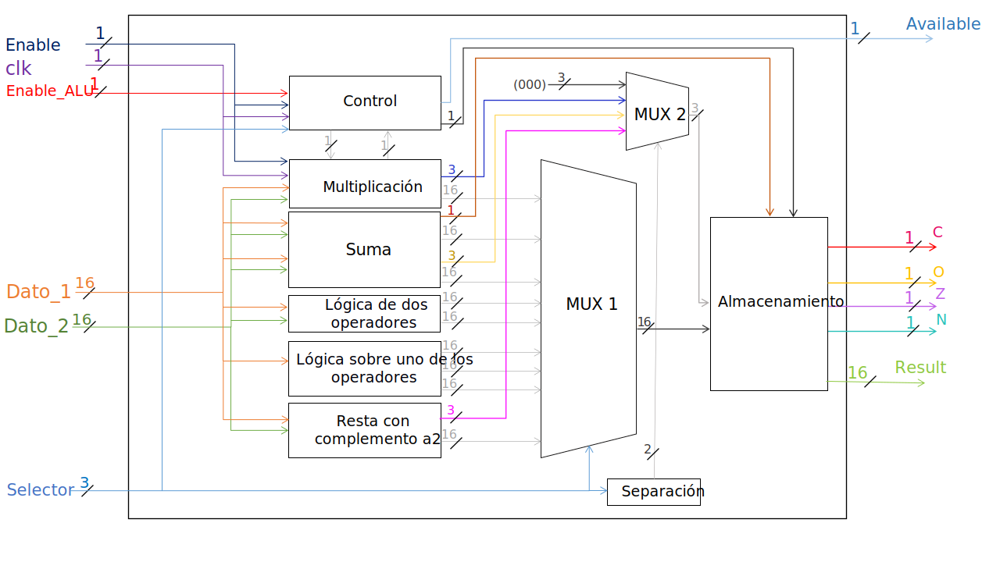

# Arithmetic Logic Unit
Programmed in VHDL using only logic gates AND, OR, NOT and XOR.

Outputs where; C = Carry, N = Negative, Z = Zero, O = Overflow.

| Selector | Operation | 
| :---: | :---: | 
| 0000 | Sum using A2 |
| 0001 | Subtract using A2 |
| 0010 | Multiplication using A2 |
| 0011 | AND |
| 0100 | OR |
| 0101 | NOT |
| 0110 | Displacement |
| 0111 | Rotate |
| 1000 | Sum with carry |
